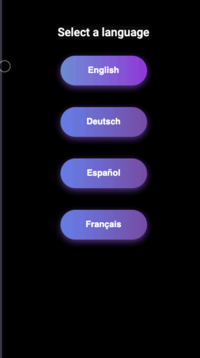
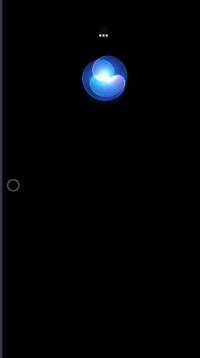
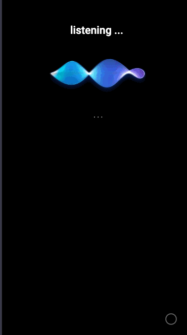

# Multilingual back-and-forth voice conversation and data extraction using AWS Bedrock (Llama3), AWS Transcribe and AWS Polly written in Angular.

 &nbsp;&nbsp;&nbsp;  &nbsp;&nbsp;&nbsp;  


This repository provides a PoC implementation of using [Amazon Bedrock](https://aws.amazon.com/bedrock/) and other supporting AWS services to have a voice conversation with a Foundational AI model, specifically Llama3, analyse the transcript and collect specific information.
The code demonstrates how to build an application with GenAI that supports natural back-and-forth voice conversations.

Key aspects shown in the code:

- Streaming transcription of user speech to text with [Amazon Transcribe](https://aws.amazon.com/pm/transcribe)
- Making requests to Amazon Bedrock with transcribed text
- Streaming text responses from Amazon Bedrock to speech with [Amazon Polly](https://aws.amazon.com/polly/)
- Playing back Amazon Polly speech audio to user
- Buffering user speech and Amazon Bedrock responses to enable conversational flow

In summary, this code serves as an example implementation for developers to reference when building voice-enabled applications powered by Foundational AI through Amazon Bedrock and related AWS services.

## Architecture reference

1. User voice audio is streamed in chunks to Amazon Transcribe for speech-to-text transcription.
2. Amazon Transcribe processes the audio chunks as they arrive, transcribing them to text incrementally.
3. The transcribed text is buffered in a memory object, representing the user's full message for Amazon Bedrock.
4. When the user finishes speaking (no audio in 1.5 seconds), a request is sent to Amazon Bedrock with the final transcribed text message.
5. The Amazon Bedrock text response is sent back for text-to-speech conversion.
6. The response from AWS Bedrock is submitted to Amazon Polly to synthesize into speech audio.
7. The Polly speech audio chunks are played back incrementally on the user's device as they arrive.

## Prerequisites

For this solution, you need the following prerequisites:

* Node.js v.22+  
  
* An [IAM](https://aws.amazon.com/iam/) user with enough permissions to use [Amazon Bedrock](https://aws.amazon.com/bedrock/), [Amazon Transcribe](https://aws.amazon.com/pm/transcribe), and [Amazon Polly](https://aws.amazon.com/polly/).  
  `Note`: Please ensure that the underlying Foundational Model in Amazon Bedrock, llama3, is enabled in your AWS Account. To enable access, please see [Model access](https://aws.amazon.com/bedrock/llama/).

```shell
{
    "Version": "2012-10-17",
    "Statement": [
        {
            "Sid": "VisualEditor0",
            "Effect": "Allow",
            "Action": [
                "transcribe:StartStreamTranscription",
                "transcribe:StartStreamTranscriptionWebSocket",
                "bedrock:InvokeModel",
                "polly:SynthesizeSpeech"
            ],
            "Resource": "*"
        }
    ]
}
```

To configure the information to collect in the conversation you can use the example.ts file or pass a base64 encoded string with the same json schema.

```shell
  public static convoShort: DynamicForm = {
    OrganisationName: "Lawyers Inc.",
    DynamicFields: [
      {
        Name: "Name",
        Description: "Name of the client",
        FieldType: "string",
      },
      {
        Name: "Mobile",
        Description: "Mobile number of the client",
        FieldType: "string",
      },
      {
        Name: "seeking",
        Description: "Type of service required",
        FieldType: "Legal representation|Legal Advice|Other",
      },
    ],
  };
```

## Running the app

First you need to set your AWS credentials in the aws.ts file. *ATTENTION: This is an angular app and all files are public, for production environments make sure you get federated credentials*.

```shell
export class AWS {
  public static accessKeyId = "";
  public static secretAccessKey = "";
  public static region = "";
}
```

Install npm packages

```shell
npm install
```

Run the application

```shell
npm start
```

and finally open the app at http://localhost:4200/

## License

This library is licensed under the MIT-0 License.